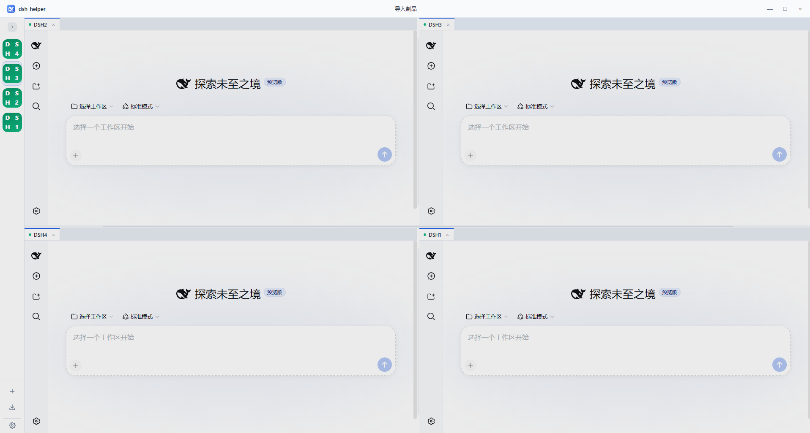

### Hi there 👋

🍊 coding by day · 🍌 coding by night

🚀 **我的作品站点**：[https://x102201.github.io](https://x102201.github.io/)

---

### 作品 / Projects

<table>
  <tr>
    <td width="55%" valign="top">
      <a href="https://github.com/x102201/deepseek-harness-helper"><strong>DSHHelper</strong> — DeepSeek Harness 桌面助手</a>
        
      单机多开、隔离运行多套 DeepSeek Harness（dsh）；内置运行时，支持分屏与 <code>.dshpack</code> 环境迁移。
        
      🖥️ <strong>全平台支持</strong> — Windows / macOS / Linux，兼容 x64 与 ARM 
      🔀 <strong>多实例并行</strong> — 单机可部署多个 dsh 实例，可独立运行，也可协同完成同一项工作 
      🪟 <strong>可拖拽分屏</strong> — 标签页可自由拖出并吸附组合，支持二分、三分、四分及多分屏布局 
      📦 <strong>环境迁移</strong> — 支持导出为 <code>.dshpack</code>，换机后一键恢复完整环境
        
      <a href="https://github.com/x102201/deepseek-harness-helper">查看仓库 →</a>
    </td>
    <td width="45%" valign="middle" align="right">
      
    </td>
  </tr>
</table>
